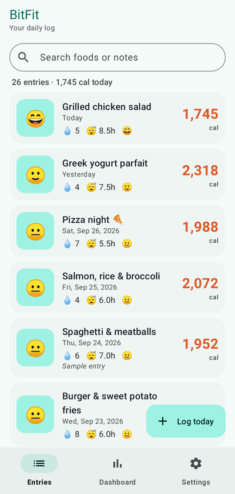
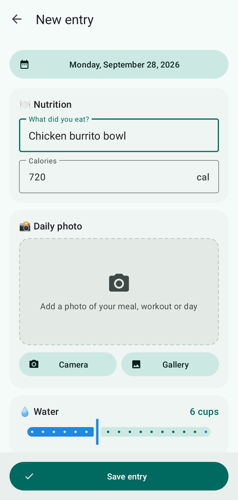
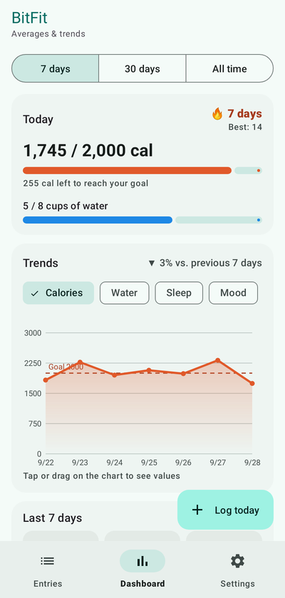
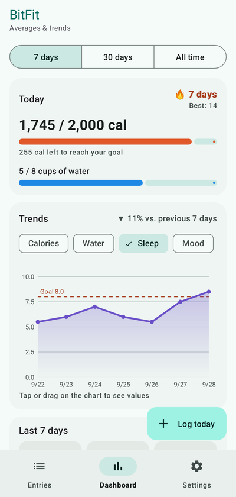
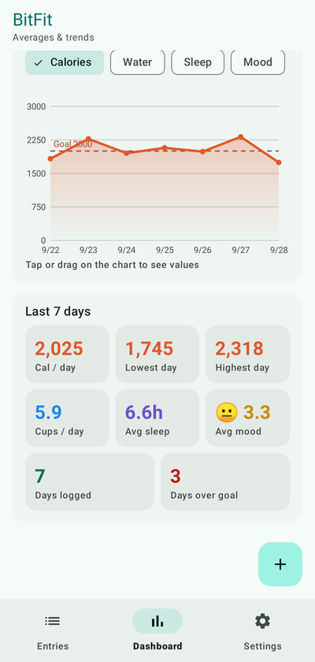
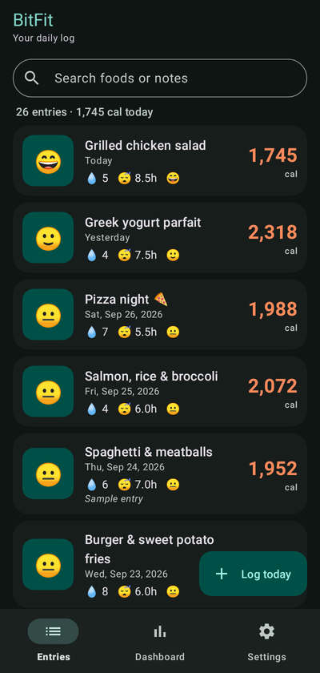
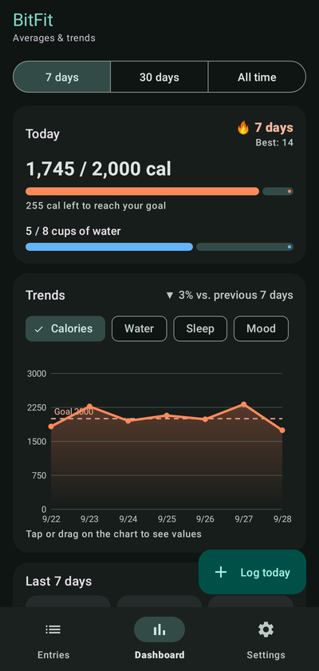
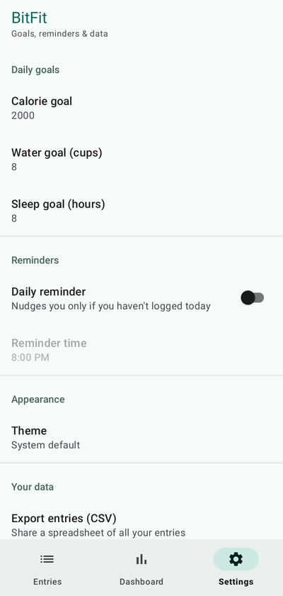
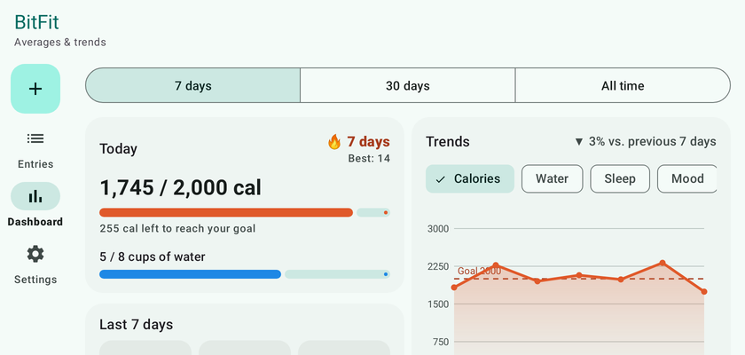
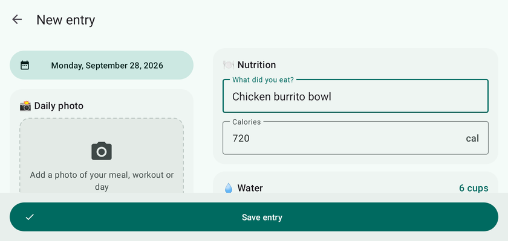

# Android Project 5 - *BitFit*

Submitted by: **Dan Sevalie-Gborie**

**BitFit** is a health metrics app that allows users to track what they eat (food + calories), how much water they drink, how long they sleep and how they feel each day — with an optional daily photo. Everything is stored locally in a Room (SQLite) database, so the app works fully offline and remembers every entry between launches. A dashboard shows averages, streaks, goal progress and interactive trend charts.

Time spent: **20** hours spent in total (20 Part 1, 30 Minutes Part 2 [all features were already added])

## Required Features - Part 1

The following **required** functionality is completed:

- [x] **At least one health metric is tracked (based on user input)**
  - Chosen metrics = **Nutrition (food + calories), Water (cups), Sleep (hours), Mood (1–5)**
- [x] **There is a "create entry" UI that prompts users to make their daily entry**
- [x] **New entries are saved in a database and then updated in the RecyclerView**
- [x] **On application restart, previously entered entries are preserved (i.e., are persistent)**

The following **optional** features are implemented:

- [x] **Create a UI for tracking averages and trends in metrics**
  - Dashboard tab with averages / lowest / highest calorie day, average water, sleep and mood, days logged, days over goal
  - 7-day / 30-day / all-time ranges
  - Custom-drawn, interactive trend chart for every metric (tap or drag to read values), goal line, and "▲/▼ % vs. previous 7 days"
- [x] **Improve and customize the user interface through styling and coloring**
  - Custom Material 3 teal + coral palette, per-metric colors, rounded cards, custom adaptive app icon, splash screen
  - Full dark mode (plus an in-app Light / Dark / System theme picker)
- [x] **Implement orientation responsivity**
  - Alternate `layout-land` files: navigation rail instead of bottom bar, two-column dashboard, side-by-side create-entry form
  - Entries list switches to a 2-column grid in landscape (3 columns on tablets in landscape)
  - Form input, selected tab, photo and date survive rotation (ViewModel + SavedStateHandle)
- [x] **Add a daily photo feature (Hint: Photos are not typically stored in databases for size concerns, so you should store the path instead)**
  - Take a photo with the camera or pick one from the gallery; the image is saved in the app's private storage and only its **file path** is stored in Room
  - Thumbnails in the list (Glide), tap the photo to view it full screen, replace or remove it

The following **additional** features are implemented:

* [x] Tracks **4 metrics** in one entry: food + calories, water, sleep and mood (emoji mood picker)
* [x] **Edit** any entry by tapping it, and **delete** it from the edit screen (with confirmation)
* [x] **Swipe to delete** with an **Undo** Snackbar
* [x] **Search** entries by food or notes
* [x] **Bottom navigation with 3 fragments** (Entries, Dashboard, Settings)
* [x] **Daily goals** for calories, water and sleep (editable in Settings) with "Today" progress bars and goal lines on the chart
* [x] **Streaks**: current logging streak 🔥 and best streak
* [x] **Daily reminder notification** (WorkManager) at a time you choose — it only fires if you haven't logged anything that day; handles the Android 13+ notification permission
* [x] **Food autocomplete**: foods you've logged before are suggested and auto-fill their calories
* [x] **Date picker** to log or back-date entries (future dates are blocked)
* [x] **Export all entries to CSV** and share them (FileProvider)
* [x] **"Add sample entries"** button that fills in ~30 days of demo data to explore the dashboard, plus **"Delete all entries"**
* [x] Input validation with inline error messages
* [x] Friendly empty states for the list, search results and dashboard
* [x] Animations: list items animate in, chart draws itself in, "Log today" button collapses while scrolling
* [x] Edge-to-edge layout that respects system bars and the keyboard (Android 15 ready)
* [x] Unused photo files are cleaned up when a photo is replaced or an entry is deleted
* [x] Accessibility: content descriptions on images, chart and list items
* [x] **MVVM architecture**: Room DAO → Kotlin `Flow` → ViewModel → UI, so the database is the single source of truth and the list/dashboard update automatically
* [x] **Automated tests** (`./gradlew test`): stats/averages/streak math, the Room DAO (in-memory database), and end-to-end "create entry → saved in DB → shown in the list/dashboard" flows

## Required Features - Part 2

The following **required** functionality is completed:

- [x] **Use at least 2 Fragments**
  - The app uses three: Entries, Dashboard and Settings
- [x] **Create a new dashboard fragment where users can see a summary of their entered data**
  - Shows averages, lowest and highest day, current and best logging streak, and today's progress toward daily goals
- [x] **Use one of the Navigation UI Views (BottomNavigation, Drawer Layout, Top Bar) to move between the fragments**
  - BottomNavigation with Entries, Dashboard and Settings tabs; the selected tab is kept when the screen rotates

The following **optional** features are implemented:

- [x] **Add a more advanced UI (e.g: Graphing) for tracking trends in metrics**
  - Interactive trend chart for each metric over 7 days, 30 days or all time, with a goal line
- [x] **Implement daily notifications to prompt users to fill in their data**
  - Daily reminder at a time you choose in Settings; tapping it opens the new-entry screen
  - "Send a test reminder" button to see the notification right away

The following **additional** features are implemented:

- [x] Tracks **4 metrics** in one entry: food + calories, water, sleep and mood (emoji mood picker)
- [x] Optional **daily photo** with a full-screen photo viewer
- [x] **Edit** any entry by tapping it, and **delete** it from the edit screen (with confirmation)
- [x] **Swipe to delete** with an **Undo** option
- [x] **Search** entries by food or notes
- [x] **Daily goals** for calories, water and sleep (editable in Settings) with "Today" progress bars
- [x] **Food autocomplete**: foods you've logged before are suggested and auto-fill their calories
- [x] **Date picker** to log or back-date entries (future dates are blocked)
- [x] **Export all entries to CSV** and share them
- [x] **"Add sample entries"** button that fills in ~30 days of demo data, plus **"Delete all entries"**
- [x] **Light / Dark / System theme** picker
- [x] **Landscape layouts**: the entries list switches to a 2-column grid, and typed-in form data survives rotation
- [x] Input validation with inline error messages
- [x] Friendly empty states for the list, search results and dashboard
- [x] Custom app icon and splash screen
- [x] Animations: list items animate in, charts draw themselves in, the "Log today" button collapses while scrolling
- [x] **Automated tests**: 18 unit tests covering the averages/streak math, the Room DAO, and the create-entry → database → list flow

## Video Walkthrough

Here's a walkthrough of implemented user stories:

[Watch the Video](https://youtube.com/watch?v=Lp_f9I2oiD8/edit)

## Screenshots

| Entries | Create entry | Dashboard | Dashboard (sleep) |
|:---:|:---:|:---:|:---:|
|  |  |  |  |

| Averages | Dark mode | Dark dashboard | Settings |
|:---:|:---:|:---:|:---:|
|  |  |  |  |

| Landscape dashboard | Landscape entry form |
|:---:|:---:|
|  |  |

## How it's built

| Piece | Where |
|---|---|
| Room entity (one log entry, incl. `photo_path`) | `data/EntryEntity.kt` |
| DAO (`observeAll()` Flow, insert, update, delete…) | `data/EntryDao.kt` |
| Database singleton | `data/AppDatabase.kt` |
| Create / edit entry screen | `ui/EntryActivity.kt`, `ui/EntryViewModel.kt` |
| Entries list (RecyclerView + ListAdapter, search, swipe/undo) | `ui/EntriesFragment.kt`, `ui/EntryAdapter.kt` |
| Dashboard (averages, streaks, goals) | `ui/DashboardFragment.kt`, `util/StatsCalculator.kt` |
| Custom trend chart | `ui/TrendChartView.kt` |
| Settings, CSV export, demo data | `ui/SettingsFragment.kt`, `util/CsvExporter.kt`, `util/SampleData.kt` |
| Daily reminder | `reminder/ReminderScheduler.kt`, `reminder/ReminderWorker.kt` |
| Landscape layouts | `res/layout-land/` |

All database work runs off the main thread (`Dispatchers.IO` / Room suspend functions), which avoids the *"Cannot access database on the main thread"* error.

## Notes

- **One source of truth:** the create-entry screen never sends data back to the list directly. It writes to Room, and the list observes a Room `Flow`, so it refreshes on its own after every insert, edit, delete or undo.
- **Photos:** images are far too big for a database row, so they are copied into the app's private `files/photos/` folder and only the path is saved. The camera writes straight into that folder through a `FileProvider`.
- **Challenges:** selecting the first tab in `BottomNavigationView` on launch triggers the *reselected* listener rather than the *selected* one, so the first tab has to be shown explicitly. Landscape layouts also need unique view IDs where the view types differ (the extended FAB vs. the rail's FAB), or View Binding casts to the wrong type. Android 15's edge-to-edge default meant handling window insets for the toolbar, bottom bar and keyboard.

## License

    Copyright 2026 Dan Sevalie-Gborie

    Licensed under the Apache License, Version 2.0 (the "License");
    you may not use this file except in compliance with the License.
    You may obtain a copy of the License at

        http://www.apache.org/licenses/LICENSE-2.0

    Unless required by applicable law or agreed to in writing, software
    distributed under the License is distributed on an "AS IS" BASIS,
    WITHOUT WARRANTIES OR CONDITIONS OF ANY KIND, either express or implied.
    See the License for the specific language governing permissions and
    limitations under the License.
